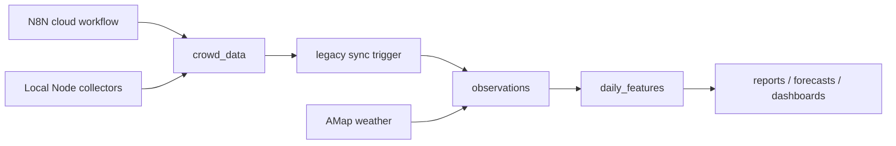

# Tianzifang v2 Upgrade

This document describes the v2 redesign for the Tianzifang crowd data project. The upgrade is additive: it keeps the legacy `crowd_data` and `daily_summary` tables, then adds a normalized observation layer and derived feature tables on Neon.

Current release: `1.4.2`

## Goals

- Keep Neon PostgreSQL as the only database path.
- Preserve the existing N8N workflow and legacy tables during migration.
- Normalize all collected signals into one observation model.
- Stop treating point-in-time `in_park_count` samples as cumulative visitor totals.
- Add validated weather context from China-facing providers where available.
- Produce daily analysis features that can support reports, forecasting, and future dashboards.

## Context7 Notes

The v2 implementation was checked against current Context7 documentation for:

- `pg`: continue using an explicit `Pool`, parameterized queries, pool error handling, and client checkout only when transactions are needed.
- `zod`: validate external API JSON with runtime schemas and `safeParse`.
- `node-cron`: keep `timezone: 'Asia/Shanghai'` and `noOverlap: true` for local scheduled jobs.

## Architecture



## Database Model

### Existing Tables

- `crowd_data`: legacy write target for N8N and local collectors.
- `daily_summary`: legacy daily reporting table.
- `schema_migrations`: idempotent schema migration ledger.

### v2 Tables

- `data_sources`: source registry with reliability, cadence, notes, and active state.
- `collection_runs`: execution log for collector runs and backfills.
- `observations`: normalized fact table for all metrics, including `period` anchors for reported historical crowd claims.
- `daily_features`: derived per-day analytical features, with optional `reported_visitors*` fields for true day-level visitor counts.

The `sync_crowd_data_to_observations` trigger mirrors future legacy writes into `observations`. Historical legacy rows are backfilled during `npm run v2:init`.

## Data Semantics

`gov_tour / in_park_count` means current occupancy at a sample time. It is not a turnstile count and must not be summed into daily visitors.

v2 daily features use:

- `sample_count`, `measured_count`: sampling volume and measured-quality sample count.
- `avg_in_park`, `p50_in_park`, `p95_in_park`, `max_in_park`: occupancy statistics.
- `coverage_minutes`: valid integration coverage, ignoring gaps over 30 minutes.
- `occupancy_person_hours`: trapezoidal integration of in-park occupancy over time.
- `estimated_visits_low/mid/high`: dwell-time model only, using 2h, 1.5h, and 1h assumptions.
- `reported_visitors`, `reported_visitors_source`, `reported_visitors_confidence`: populated only from true day-level reported visitor counts.
- `activity_event_count`, `context_signal_count`, `strongest_context_confidence`: activity, policy, media, mobility, operations, and other demand-context anchors active on that date.
- `quality_score`: coverage and measured-sample based confidence for the day.

## Historical Sources

### Implemented

- Reported historical crowd and activity/context anchors with provenance via `npm run v2:import-crowd-anchors`. See [`HISTORICAL_CROWD_SOURCES.md`](HISTORICAL_CROWD_SOURCES.md).
- AMap Weather API for Huangpu District current and forecast weather:
  - `weather_temp_max`
  - `weather_temp_min`
  - `weather_condition_day`
  - `weather_condition_night`

AMap is useful for Tianzifang's district-level weather context because Tianzifang is in Huangpu District (`310101`). It is not a block-level coordinate weather grid and does not provide historical hourly backfill through the public weather endpoint.

### Candidate Next Sources

- Official Shanghai scenic spot data archives if a documented endpoint or downloadable archive becomes available.
- More manually verified historical crowd anchors, but only with source URL, quote, confidence, and period semantics.
- AMap contextual data for nearby POI, transit, or traffic indicators. Treat this as context, not ground-truth visitation.
- Public or licensed mobility/attention indexes: metro station load, road traffic, map popularity, search interest, short-video visibility, and travel-guide mentions.
- Local operations and neighborhood demand calendars: closures, entrance controls, construction, exhibitions, festivals, school breaks, office/workday cycles, hotel/tour-group recovery, and promotion periods.
- Public holiday and adjusted workday calendars for future years, preferably generated from a maintained source instead of hard-coded year tables.

## Commands

Initialize all schemas and backfill legacy rows:

```bash
npm run v2:init
```

Collect current and forecast district weather:

```bash
npm run v2:collect:amap-weather
```

Import verified historical crowd anchors:

```bash
npm run v2:import-crowd-anchors
```

Generate a blog-ready HTML report:

```bash
npm run v2:report-html
```

Derive daily analytical features:

```bash
npm run v2:derive -- 2025-10-03 2026-07-07
```

Show v2 counts and latest derived days:

```bash
npm run v2:summary
```

## Upgrade Plan

### P1 - Completed in v1.3.0

- Add v2 normalized Neon schema and source registry.
- Add legacy-to-v2 trigger and historical legacy backfill.
- Add provider-validated weather collection hooks.
- Add daily feature derivation based on occupancy statistics and person-hours.
- Add v2 CLI scripts and documentation.

### P2 - Completed in v1.4.2

- Add an import path for manually curated historical observations with source, confidence, quote, URL, and period notes.
- Expand the historical/event anchor set to 11 entries covering 2024-2026 reported visitor counts, partial-day figures, instant peaks, activities, and policy/media context.
- Keep period claims separate from daily visitor totals so reported holiday peaks do not pollute daily telemetry.
- Add `activity_event_count`, `context_signal_count`, and an HTML report generator for blog embedding.

### P2 - Next

- Move the N8N workflow to write validated values only, especially for weather fields that currently can become zero when parsing fails.
- Add alerting for stale `gov_tour` samples, zero-like weather parse failures, and collector HTTP/schema errors.
- Add tests for AMap schema validation and daily feature calculations.

### P3 - Later

- Build a dashboard over `daily_features` with date range, weekday/holiday, weather, and peak-hour comparisons.
- Add forecast experiments using only features with adequate `quality_score`.
- Evaluate external contextual sources, keeping them clearly separated from measured crowd data.
- Consider partitioning `observations` by month only if row volume grows enough to justify the operational complexity.

## Safety Notes

- No local database is used or supported.
- v2 migration is non-destructive and does not drop legacy tables.
- Any destructive cleanup should be preceded by a backup table and explicit review.
- Source files are UTF-8. PowerShell can display Chinese as mojibake even when the file contents are healthy.
